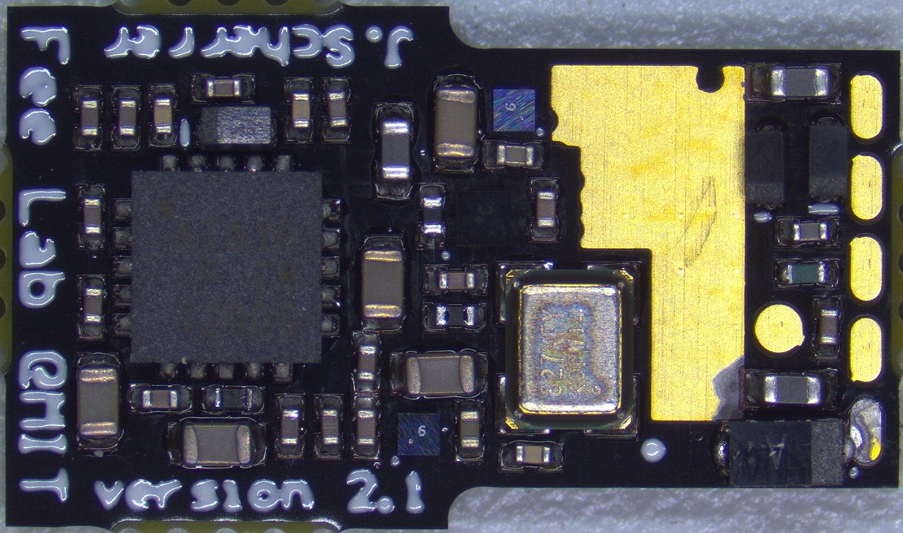

# Getting Started

Welcome to the repository on all things related to the Featherscope and Kiloscope, two light-weight head-mounted microscopes developed in the Fee lab at MIT. Our intent with this repository is to give you all the information you need to build your own scopes to use in your lab. We are also excited about people using elements of this project for their own microscope designs. Please let us know if you have any feedback or suggestions for improving these resources--we are always looking for ways to make this project more useful to the community!

The microscopes described in this repository are featured in [this bioRxiv paper](https://www.biorxiv.org/content/10.1101/2021.09.03.458947v2). All the analysis code in the paper can be found at [this repository](https://github.com/FeeLab/Microscope-Paper-Code), and the raw data from the paper is posted [here](https://academictorrents.com/details/aa2a3d2f5ff0b3974871db47db57bc3dabf3c192).

A fully functional system is comprised of the microscope itself, a DAQ and acquisition computer, a laser and associated illumination optics, and (optionally) a commutator for long-term recording. The components necessary for each of these subsystems are listed in `main_bom.ods` along with a cost breakdown.

# Microscope

Each microscope is built from small optical components mounted inside 3D printed parts. The optics needed for each microscope can be found under the Kiloscope and Featherscope tabs of `main_bom.ods`. The STEP files for the printed parts are located in the `body_components` folder. Technical details about the construction process can be found in the Methods section of the paper.

## Aspheric Lenses

The aspheric lens assemblies used in the Kiloscope are taken from replacement rear camera modules for the Samsung Galaxy S9 phone. These modules can be purchased online from 3rd party vendors, however the lenses then need to be carefully removed from the assembled housing. The lens module must first be removed from the sensor PCB using pliers. The outer sheet metal shell surrounding the lens module can then be removed by first sliding a scalpel underneath on all sides to remove mounting glue, and then carefully prying off the shell. The lens will then slide out of the housing. The remaining hardware attached to the lens can be clipped off with precision electronics pliers. Note that the lens material is very easy to scratch and difficult to clean, so be careful not to touch the lens faces during this process! When you have extracted the lens, you can store it safely in a PDMS device carrier (we reuse the containers that Edmund Optics ships their prisms in).

## Ground GRIN Lenses

The tube lens used in the Featherscope is a GRIN lens purchased from Edmund Optics that has been ground down to a total length of 1 mm. Ideally we would have GRINTech, the manufacturer of the original lenses, make us custom lenses with the correct length to begin with. However, GRINTech and Inscopix have signed an anticompetitive exclusive distribution agreement for one-photon calcium imaging, so we have to be a little more creative about how we get these components. We purchase lenses from Edmund Optics (part number in BOM) and have them ground down to 1.00 mm by Pioneer Precision Optics, a custom optics company based in Massachusetts.

## 3D Prints

We have had success ordering prints from [Rosenberg Industries](https://www.rosenbergindustries.com), a company based in Minnesota that specializes in prints for neuroscience implant devices. Parts are printed in Formlabs Grey resin at 25 micron resolution.

## Printed Circuit Boards

We order our image sensor boards from [Speedy Circuits](http://www.speedy-circuits.com.tw/), a board house in Taiwan that specializes in small run fabrication and assembly. We highly recommend the additional cost of board assembly unless you really want to practice your BGA soldering skills! Boards can be ordered using the gerber files found in the `python_pcb` folder.

Here are the specifications for the boards if you want to order them from another board house.

| Parameter       | Value       |
| -----------     | ----------- |
| Layer Count     | 6           |
| Copper Weight   | 1.1 mil external, 0.7 mil internal |
| Board Thickness | 500 micron |
| Dimensions | 8.2 x 14.0 mm |
| Number of Holes | 146 |
| Min Hole Size | 3 mil |
| Blind Vias | L1-L4 |
| Min Trace/Space | 3 mil |
| Vias in Pad | Epoxy Filled and Plated |
| Surface Finish | Immersion gold, 2 micron |

The board design files are free to view with Altium but require an Altium license to edit. If you are a student, you can obtain an [educational license](https://www.altium.com/education/student-licenses) for free. Let us know if you would like to convert the design files to an open-source format like KiCad and we would be happy to assist.

## Assembly

Step-by-step instructions for assembling the microscopes are provided in `scope_assembly_instructions.odp`. Most components are secured using UV cure optical cement that can be purchased from [Edmund Optics](https://www.edmundoptics.com/f/norland-optical-adhesives/11818/) or a similar supplier. These instructions are a work in progress, so please don't hesistate to contact us if any of the steps are unclear!

 

## Programming

Firmware for the Attiny on the PCB can be found in `attiny_firmware`. Source code is included, with the exception of a section of `sensor_power_sequencing.c` that is restricted under NDA with Arrow, a distributor of ONSemi components. If you want access to the register settings contained in this section of the source code, contact an ONSemi distributor and request an NDA for the Python 480 programming notes.

The compiled code is contained in `Mscp_code/Release/Mscp_code.elf` and can be uploaded to the microcontroller using [Atmel Studio](https://microchipdeveloper.com/install:atstudio). We use [this programmer](https://www.microchip.com/en-us/development-tool/ATATMEL-ICE) but anything compatible with UPDI should work.

# DAQ System

## Hardware
The DAQ hardware is based on that of the [UCLA Miniscope](https://github.com/Aharoni-Lab/Miniscope-v4/wiki/DAQ-Hardware) and uses similar fabrication parameters. We had ours fabricated and assembled by [Seeed Studio](https://www.seeedstudio.com/) since these boards don't have as demanding specifications as the image sensor boards. Fabrication files can be found in the `DAQ` folder.

You will need to flash the firmware onto EEPROM before using the boards. Compile the DAQ firmware code in `cypress_firmware` using the [Cypress USB Suite](https://www.infineon.com/cms/en/design-support/tools/sdk/usb-controllers-sdk/ez-usb-fx3-software-development-kit/?utm_source=cypress&utm_medium=referral&utm_campaign=202110_globe_en_all_integration-software) and load it onto the board following the directions for the [UCLA Miniscope](https://github.com/Aharoni-Lab/Miniscope-DAQ-Cypress-firmware).

## Recording Software
The DAQ board presents itself to your computer as a webcam device, and for testing can be opened as a streaming device in [VLC](https://www.videolan.org/vlc/). For experiments, we acquire data from the microscope using [Bonsai](https://bonsai-rx.org/), a reactive programming languange designed for the multiple asynchronous data streams typical of behavioral neuroscience experiments. Bonsai has modules for recording from the UCLA Miniscope, Neuropixels, National Instruments devices, Arduinos, and various other data streams. We have written a module for our microscopes that can be downloaded from the Bonsai package manager. The module outputs video data in RGB565 format and allows for control of the image sensor gain. The source code can be found in `bonsai_module`.

An example Bonsai script for recording can also be found in `bonsai_module`. This script saves video from both the microscope and from an animal tracking camera simultaneously, while recording timestamps for each frame of both streams. Video is saved in the raw RGB565 format, but the script also performs realtime conversion to a human-interpretable grayscale image for online monitoring of the fluorescence signal.

# Illumination Optics

## Laser
Illumination light is provided by a multimode 473 nm laser similar to those used in optogenetics experiments. We use the MBL-473-50mW laser from [CNI Laser](http://www.cnilaser.com/), an optics company based in China with a wide range of turnkey optical systems for neuroscience applications. If you are planning on imaging at a different wavelength or have other specific requirements, they will probably be able to match your requirements.

## Coupling Optics
Light from the laser is coupled into the fiber using a system of optics detailed in the methods section of the paper and in `main_bom.ods`. Optics are assembled in a Thorlabs cage plate system for ease of alignment.

In the paper, we include a shutter so that illumination can be turned off when not recording to avoid photobleaching. However, the MBL-473-50mW laser from CNI has a TTL modulation input that can also be used to turn the laser on and off. The shutter is only needed in settings where the illumination power needs to be very stable over the course of the recording, as modulating the laser current results in temporary thermal instability in the laser cavity and a period of minor intensity variability.

The despeckler used in the paper has been discontinued since publication. Luckily, we have since developed a homemade despeckler that is both cheaper and more efficient than the previous despeckler, and can be built by hand in a few hours. We will post construction details as soon as we have the release version finalized, so follow this space for more details.

# Commutator
For recording sessions that last 30 minutes or less, you may be able to use a static recording setup without the animal twisting the tether excessively. However, for longer-term recordings or with very active or sensitive animals (e.g. birds), a commutator will be necessary to avoid tether wrapping issues. 

We have designed an actively driven commutator for the microscopes that simultaneously transmits power, data, and illumination light. Design files, along with notes on assembly, can be found in the `commutator` directory as well as in `main_bom.ods`.

## Machined components
The commutator base consists of two custom machined aluminum plates. Drawings for these plates can be found in the `commutator` folder. They can be fabricated by your favorite machine shop or online machining service (we use [Protolabs](https://www.protolabs.com/services/cnc-machining/)).

## PCB
The commutator PCB provides regulated power to the microscope and sends a torque signal to the motor controller. It is a simple two-layer board and can be fabricated by [OSHPark](https://oshpark.com/). Design files can be found in `commutator/sensor_board` in EAGLE format. Autodesk offers free educational licenses for EAGLE.

## Motor Controller Box
The commutator is driven by a Faulhaber DC motor controlled by a custom motor driver. The PCB for the driver can be found in `commutator/motor_controller` and can be fabricated by OSHPark. Components and assembly notes for the driver box can also be found in `commutator/motor_controller`.
